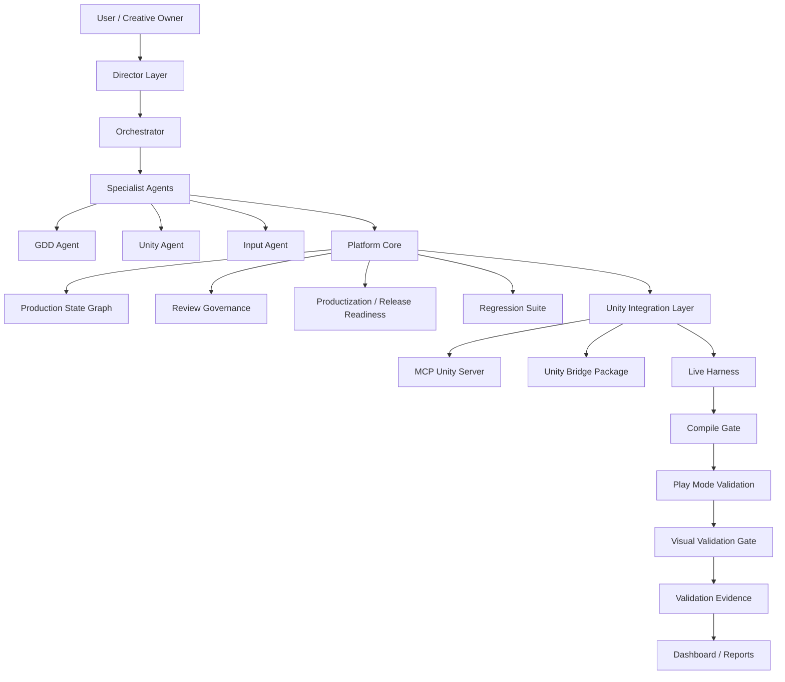

[English](README.md) | [한국어](README.ko.md)

# AInvil

**AInvil**은 검증 증거 기반 Unity 게임 제작 AI Agent Workflow Platform입니다.

AInvil은 단순한 Unity MCP 래퍼나 코드 생성기가 아닙니다.
사용자의 창작 의도를 보존하면서, 게임 기획, 기술 설계, Unity 구현, 컴파일 검증, Play Mode 검증, Visual Validation, Evidence 생성, Dashboard / Productization / Release Readiness 판단까지 연결하는 계층형 게임 제작 시스템입니다.

현재 검증된 사례는 **DungeonRecoveryCompany**입니다.
AInvil은 이 프로젝트에서 절차적 던전 복구 의뢰 프로토타입을 생성하고, Play Mode와 빌드, 시각 검증까지 완료했습니다.

---

## 현재 상태

AInvil의 현재 분류는 다음과 같습니다.

| 수준                                      | 상태  |
| --------------------------------------- | --- |
| Core Release Ready / Release Candidate  | Yes |
| Core RC Reproducibility Verified        | Yes |
| Canonical Unity Bridge Package Verified | Yes |
| Product MVP Ready Candidate             | Yes |
| Public Release Ready                    | No  |

이 의미는 AInvil이 **단일 프로젝트 사례에서 Unity 게임 제작 workflow를 실제로 검증했다**는 것입니다.

다만 아직 다음을 의미하지는 않습니다.

* 공개 배포 가능한 제품
* 일반 사용자가 설치해 바로 쓸 수 있는 제품
* 모든 Unity 프로젝트에서 검증된 범용 도구
* 완전 자동 게임 제작 시스템

---

## 현재 AInvil이 증명한 것

AInvil은 현재 다음을 증명했습니다.

* 사용자 게임 요청을 Feature / Requirement / Task / Acceptance Criteria로 변환할 수 있음
* Unity 게임 코드와 씬을 생성할 수 있음
* Play Mode 진입 전에 Compile Gate를 실행할 수 있음
* Unity Play Mode에서 실제 런타임 동작을 검증할 수 있음
* GameView screenshot 기반 Visual Validation을 수행할 수 있음
* 제품 실패, 컴파일 실패, 환경 실패를 구분할 수 있음
* Unity Bridge 문제가 발생해도 LastKnownPassed evidence를 보존할 수 있음
* Evidence, Dashboard, Productization Report, Release Readiness Report를 생성할 수 있음
* Windows development build를 생성하고 검증할 수 있음

현재 증명 범위는 **단일 프로젝트 Product MVP Case Study**입니다.

---

## 검증된 기능

| 기능                                | 상태                             |
| --------------------------------- | ------------------------------ |
| Unity Bridge Smoke Validation     | Passed                         |
| Compile Check                     | Passed                         |
| Compile Gate Safety               | Passed                         |
| First Playable E2E                | Passed                         |
| Human Playability Review          | Passed                         |
| Procedural Recovery Job           | Passed                         |
| Random Startup Seed               | Passed                         |
| Fixed Seed Determinism            | Passed                         |
| First Person Control / Mouse Look | Passed                         |
| Procedural Space Quality          | Passed                         |
| Visual Validation Gate            | Passed                         |
| Windows Build Verification        | Passed                         |
| Full Regression                   | 21 passed, 0 failed, 0 blocked |
| Production Core Review            | Approved                       |
| Productization                    | Release Candidate              |
| Release Readiness                 | Release Ready                  |
| Public Release Ready              | No                             |

---

## 사례 연구: DungeonRecoveryCompany

`DungeonRecoveryCompany`는 현재 AInvil의 Product MVP 검증 사례입니다.

AInvil은 이 프로젝트에서 다음을 생성하고 검증했습니다.

* 첫 플레이어블 복구 의뢰
* 사람이 직접 플레이해 확인한 playable build
* 절차적 던전 복구 의뢰
* 실행 시 랜덤 seed 생성
* 고정 seed 기반 deterministic generation 검증
* 1인칭 이동과 마우스 룩
* 복구 목표 랜덤 배치
* 목표 접근 가능성 검증
* 넓어진 방, 넓은 복도, 높은 벽, primitive prop 배치
* Procedural Space Quality 검증
* Screenshot Evidence 기반 Visual Validation
* Windows development build 검증

최신 procedural validation 주요 결과는 다음과 같습니다.

| 항목                                | 결과                     |
| --------------------------------- | ---------------------- |
| 고정 검증 seed                        | `1001`, `2026`, `7777` |
| Random Startup Seed               | Verified               |
| 같은 seed의 deterministic generation | Verified               |
| 다른 seed의 layout variation         | Verified               |
| Corridor width                    | `3`                    |
| Wall height                       | `3.2`                  |
| Reachable targets                 | `3 / 3`                |
| Blocked doorways                  | `0`                    |
| Blocked targets                   | `0`                    |
| Console errors                    | `0`                    |

주요 evidence 파일:

```text
validation/evidence/EVID-ainvil-bridge-smoke-operational-latest.json
validation/evidence/EVID-dungeon-recovery-first-playable-e2e-latest.json
validation/evidence/EVID-dungeon-recovery-first-playable-human-playability-latest.json
validation/evidence/EVID-dungeon-recovery-procedural-recovery-job-e2e-latest.json
validation/evidence/EVID-dungeon-recovery-procedural-space-quality-latest.json
validation/evidence/EVID-dungeon-recovery-procedural-visual-validation-latest.json
validation/evidence/EVID-ainvil-compile-gate-blocks-playmode-latest.json
```

---

## 전체 구조

AInvil은 계층형 production system으로 구성됩니다.

```text
User
  ↓
Director Layer
  ↓
Orchestrator
  ↓
Specialist Agents
  ├─ GDD Agent
  ├─ Unity Agent
  └─ Input Agent
  ↓
Platform Core
  ├─ Production State Graph
  ├─ Production Intelligence
  ├─ Review Governance
  ├─ Workflow Runtime
  ├─ Productization
  ├─ Release Readiness
  ├─ Regression Suite
  └─ Dashboard / Reports
  ↓
Unity Integration Layer
  ├─ MCP Unity Server
  ├─ Unity Bridge Package
  ├─ Unity Editor Bridge
  ├─ Live Harness
  ├─ Compile Gate
  ├─ Play Mode Validation
  └─ Visual Validation Gate
  ↓
Validation Evidence
  ├─ Scenario Evidence
  ├─ Screenshot Evidence
  ├─ Build Verification
  ├─ Human Playability Review
  └─ Release / RC Reports
```

Mermaid 버전:



---

## Layer Overview

### 1. User Layer

사용자는 게임의 창작자이자 최종 의사결정자입니다.

AInvil은 사용자의 아이디어나 요청을 다음 production artifact로 변환합니다.

```text
Idea
→ Design Intent
→ Feature
→ Requirement
→ Task
→ Acceptance Criteria
→ Unity Implementation
→ Validation Evidence
```

AInvil은 사용자의 창작 방향을 임의로 대체하지 않고, 사용자가 의도한 게임을 구조화하고 구현하며 검증하는 역할을 합니다.

---

### 2. Director Layer

Director Layer는 AInvil의 상위 판단 계층입니다.

이 계층은 Unity 씬을 직접 수정하거나 스크립트를 생성하거나 Play Mode를 실행하지 않습니다.
대신 현재 작업이 게임의 방향성과 제품 목표에 맞는지 판단합니다.

Director Layer가 보는 것:

* 게임 비전
* 핵심 판타지
* 코어 루프
* 플레이어 경험
* 기획 품질
* 스코프 관리
* 디자인 드리프트
* 프로젝트 건강도
* 검증 커버리지
* 릴리즈 위험

`DungeonRecoveryCompany`에서 Director Layer는 다음과 같은 질문을 던집니다.

* 이것이 여전히 “복구 회사 게임”처럼 느껴지는가?
* 현재 vertical slice가 플레이 가능하고 이해 가능한가?
* 단순 입력 테스트에 머무르고 있지는 않은가?
* 다음 게임 루프는 무엇이어야 하는가?
* 이것을 Public Release Ready라고 말해도 정직한가?

---

### 3. Orchestrator

Orchestrator는 Director Layer의 판단을 실제 작업 흐름으로 바꾸는 조정자입니다.

역할:

* 사용자 요청 해석
* 현재 production state 확인
* 적절한 specialist agent로 작업 라우팅
* 기획, 구현, 검증 결과 연결
* Evidence 확인
* Dashboard / Report 갱신
* 다음 action 결정

예시:

```text
User: "절차형 던전을 1인칭으로 바꿔줘."

Orchestrator:
1. gameplay / camera 변경으로 분류
2. 관련 requirement와 acceptance criteria 확인
3. Unity Agent에게 구현 지시
4. Input Agent에게 Play Mode / Visual Validation 지시
5. evidence 확인
6. productization / release 상태 갱신
```

---

### 4. Specialist Agents

AInvil은 전문 역할별 agent로 작업을 나눕니다.

#### GDD Agent

담당 영역:

* GDD
* System Design
* Technical Design
* Feature Spec
* Requirement
* Task
* Acceptance Criteria
* Design Decision

모호한 사용자 아이디어를 production-ready specification으로 정리합니다.

#### Unity Agent

담당 영역:

* Scene 생성
* Prefab
* GameObject
* Component
* Script
* Material
* Unity Bridge operation
* Build verification

`DungeonRecoveryCompany` 사례에서 Unity Agent는 다음 경로에 생성물을 만들었습니다.

```text
Assets/AInvilGenerated/DungeonRecoveryFirstPlayable/
```

생성/구현한 것:

* First playable scene
* Procedural recovery job scene
* Player controller
* First-person camera
* Mouse look
* Recovery targets
* Room / corridor generation
* Primitive props
* Visual validation probe

#### Input Agent

담당 영역:

* Play Mode 진입
* 입력 시뮬레이션
* Validation probe 호출
* 상호작용 검증
* UI 상태 확인
* Screenshot evidence 확인
* Human playability review 반영

Input Agent는 코드가 존재하는지뿐 아니라, 실제로 플레이 중 동작하는지 확인합니다.

---

## Platform Core

Platform Core는 AInvil을 단순 채팅형 코딩 도구가 아니라 지속 가능한 production workflow로 만듭니다.

| 구성 요소                   | 역할                                                                              |
| ----------------------- | ------------------------------------------------------------------------------- |
| Production State Graph  | Vision → Feature → Requirement → Task → Unity Target → Acceptance → Evidence 추적 |
| Production Intelligence | 그래프를 읽고 위험, 누락, 다음 액션 판단                                                        |
| Review Governance       | Production Core Review, Release Gate Review 관리                                  |
| Workflow Runtime        | 운영 산출물 동기화                                                                      |
| Productization          | 기능 상태를 Verified / Partial / Blocked / Spec-only / Deprecated로 분류                |
| Release Readiness       | 릴리즈 가능 상태와 blocker 판단                                                           |
| Regression Suite        | offline/live validation suite 실행                                                |
| Dashboard / Reports     | 사람이 볼 수 있는 프로젝트 상태 생성                                                           |
| RC Baseline             | Release Candidate 기준선 저장                                                        |

---

## Unity Integration Layer

Unity Integration Layer는 AInvil을 실제 Unity Editor와 연결합니다.

| 구성 요소                  | 역할                                      |
| ---------------------- | --------------------------------------- |
| MCP Unity Server       | Codex / AInvil 호출을 Unity Bridge로 프록시    |
| Unity Bridge Package   | Unity 프로젝트에 설치되는 bridge package         |
| Unity Editor Bridge    | Unity Editor 내부 HTTP/RPC server         |
| Live Harness           | 운영 validation scenario 실행               |
| Compile Gate           | compile error가 있으면 Play Mode 차단         |
| Play Mode Validation   | Unity 런타임 동작 검증                         |
| Visual Validation Gate | screenshot / camera / UI / shader 문제 검증 |
| Input Test Bridge      | 입력과 validation hook 지원                  |

Canonical Unity Bridge package:

```text
plugins/ainvil/unity-package/Packages/com.codex.unity-bridge
```

루트의 `UnityPackage/` 디렉터리는 deprecated mirror / install artifact입니다.

---

## Validation Pipeline

AInvil의 현재 운영 검증 흐름은 다음과 같습니다.

```text
User request
  → Director judgment
  → Orchestrator routing
  → GDD / Requirement / Acceptance
  → Unity implementation
  → Asset refresh
  → Compile Gate
  → Play Mode validation
  → Visual Validation Gate
  → Validation Evidence
  → Dashboard / Productization / Review
  → Release Readiness
```

---

## Failure Classification

AInvil은 검증 실패를 다음처럼 구분합니다.

| 실패 분류                                            | 의미                                   | 기대 동작                                                 |
| ------------------------------------------------ | ------------------------------------ | ----------------------------------------------------- |
| `CompileBlocked`                                 | C# compile error 때문에 Play Mode 진입 불가 | Play Mode에 들어가지 않고 파일, 라인, 코드, 메시지 보고                 |
| `EnvironmentBlocked` / `UnityBridgeDisconnected` | Unity Bridge 또는 환경 문제로 검증 불가         | LastKnownPassed evidence 유지, Revalidation Required 표시 |
| `ProductValidationFailed`                        | 검증은 실행됐으나 acceptance 실패              | 해당 product scenario 실패 처리, 실패 assertion 보고            |

이 구분 덕분에 환경 문제가 제품 실패로 오인되지 않습니다.

---

## Compile Gate Safety

모든 Play Mode 검증은 먼저 Compile Gate를 통과해야 합니다.

Compile Gate가 확인하는 것:

* Unity Bridge health
* Unity project path
* Asset refresh / compilation state
* Unity compile status
* Unity console errors
* local `Assembly-CSharp.csproj` C# build check

검증된 safety behavior:

```text
Intentional compile error created
→ Compile Gate detected CS0103
→ Play Mode was not attempted
→ downstream runtime validation was skipped
→ temporary error file was deleted
→ compile check passed after cleanup
```

Evidence:

```text
validation/evidence/EVID-ainvil-compile-gate-blocks-playmode-latest.json
```

---

## Visual Validation Gate

Runtime logic은 통과했지만 실제 게임 화면은 망가져 있을 수 있습니다.

Visual Validation은 다음 같은 화면 문제를 잡기 위한 gate입니다.

* 카메라가 엉뚱한 곳을 비춤
* 플레이어/목표가 보이지 않음
* 1인칭 카메라 위치가 잘못됨
* UI가 화면 밖에 있음
* missing shader / magenta rendering 발생
* interaction prompt가 보이지 않음
* Job Complete UI가 보이지 않음

Visual Validation이 확인하는 것:

* GameView screenshot capture
* active camera validity
* first-person camera mode
* camera framing
* player movement
* mouse look
* UI visibility
* interaction prompt visibility
* missing shader / magenta pixel detection
* console error count

Screenshot evidence 저장 위치:

```text
reports/visual_review/screenshots/
```

Visual Validation은 Human Playability Review를 대체하지 않습니다.
사람이 직접 플레이하기 전에 명백한 시각/카메라 문제를 잡는 역할입니다.

---

## Validation Evidence

AInvil의 핵심 결과물은 “됐습니다”라는 말이 아니라 evidence입니다.

Evidence 종류:

* Operational scenario evidence
* Compile evidence
* Play Mode evidence
* Visual screenshot evidence
* Build verification evidence
* Human playability review
* Regression report
* RC baseline manifest
* Release readiness report

Evidence에는 보통 다음이 포함됩니다.

* scenarioId
* classification
* result
* validationLevel
* startedAt / completedAt
* checked steps
* console error summary
* failure reason
* blocker type
* next action

AInvil은 다음을 구분합니다.

* latest run
* latest passed evidence
* latest blocked evidence
* latest failed evidence

이 구조 덕분에 `CurrentRunBlocked` 상태에서도 `LastKnownPassed`를 보존할 수 있습니다.

---

## Plugin Entry Points

| Entry Point   | Path                                            | Purpose                                                                  |
| ------------- | ----------------------------------------------- | ------------------------------------------------------------------------ |
| Manifest      | `.codex-plugin/plugin.json`                     | Codex plugin metadata, skill registration, MCP registration              |
| Skills        | `skills/`                                       | Director, Orchestrator, GDD Agent, Unity Agent, Input Agent instructions |
| MCP config    | `.mcp.json`                                     | Unity Bridge MCP server 등록                                               |
| MCP server    | `mcp-server/server.mjs`                         | local Unity Bridge HTTP endpoint로 요청 프록시                                 |
| Unity package | `unity-package/Packages/com.codex.unity-bridge` | canonical Unity-side bridge package                                      |
| Platform core | `core/`                                         | review, productization, release, regression, runtime synchronization     |
| CLI           | `cli/ainvil-cli.mjs`                            | inspection, validation, reporting용 비-Codex entry point                   |
| Harness       | `harness/`                                      | operational / sample validation scenarios                                |
| Evidence      | `validation/evidence/`                          | runtime, visual, build, safety evidence                                  |
| Reports       | `reports/`                                      | dashboard, productization, release, regression, RC reports               |

---

## Unity Requirements

Unity integration에는 다음이 필요합니다.

* `node`로 실행 가능한 Node.js
* Unity 2021.3 이상
* Canonical Unity Bridge package 설치

```text
plugins/ainvil/unity-package/Packages/com.codex.unity-bridge
```

Unity `manifest.json` dependency 예시:

```text
file:E:/wiseongjun/ProgrammingNAssignment/GameDesigner/plugins/ainvil/unity-package/Packages/com.codex.unity-bridge
```

Unity Bridge endpoint:

```text
http://127.0.0.1:17777/rpc
```

Platform / CLI inspection 기능은 Unity 없이도 동작할 수 있습니다.
Live validation, Play Mode validation, Visual Validation, Build Verification에는 Unity Bridge가 필요합니다.

---

## Quickstart: Core RC Verification

Repository root에서 실행합니다.

```powershell
node plugins\ainvil\cli\ainvil-cli.mjs doctor --unity-project <UnityProjectPath>
node plugins\ainvil\cli\ainvil-cli.mjs compile-check --unity-project <UnityProjectPath>
node plugins\ainvil\scripts\run-ainvil-live-harness.mjs --mode probe --scenario ainvil_bridge_smoke_operational
node plugins\ainvil\cli\ainvil-cli.mjs review
node plugins\ainvil\cli\ainvil-cli.mjs productization
node plugins\ainvil\cli\ainvil-cli.mjs release
```

RC baseline 생성:

```powershell
node plugins\ainvil\cli\ainvil-cli.mjs rc
```

Unity 없이 offline regression 실행:

```powershell
node plugins\ainvil\cli\ainvil-cli.mjs regression
```

Unity Bridge가 실행 중일 때 live smoke regression 실행:

```powershell
node plugins\ainvil\cli\ainvil-cli.mjs regression --live-smoke --unity-project <UnityProjectPath>
```

---

## Quickstart: Product MVP Revalidation

`DungeonRecoveryCompany` procedural vertical slice 재검증:

```powershell
node plugins\ainvil\cli\ainvil-cli.mjs doctor --unity-project E:\wiseongjun\Unity\DungeonRecoveryCompany
node plugins\ainvil\cli\ainvil-cli.mjs compile-check --unity-project E:\wiseongjun\Unity\DungeonRecoveryCompany
node plugins\ainvil\scripts\run-ainvil-live-harness.mjs --mode probe --scenario ainvil_bridge_smoke_operational
node plugins\ainvil\scripts\run-ainvil-live-harness.mjs --mode probe --scenario dungeon_recovery_procedural_space_quality_validation
node plugins\ainvil\scripts\run-ainvil-live-harness.mjs --mode probe --scenario dungeon_recovery_procedural_visual_validation
node plugins\ainvil\cli\ainvil-cli.mjs regression --procedural --visual --space-quality --build --unity-project E:\wiseongjun\Unity\DungeonRecoveryCompany
node plugins\ainvil\cli\ainvil-cli.mjs review
node plugins\ainvil\cli\ainvil-cli.mjs productization
node plugins\ainvil\cli\ainvil-cli.mjs release
```

기대 결과:

```text
Unity Bridge Stability: Passed
Compile Check: Passed
Procedural Space Quality: Passed
Visual Validation: Passed
Regression: Passed
Production Core Review: Approved
Productization: Release Candidate
Release Readiness: Release Ready
Public Release Ready: No
```

---

## Local Validation

Repository root에서 다음을 실행합니다.

```powershell
node plugins\ainvil\scripts\generate-benchmark-report.mjs
node plugins\ainvil\scripts\validate-benchmark-report.mjs
node plugins\ainvil\scripts\validate-ainvil-plugin.mjs
node plugins\ainvil\scripts\validate-ainvil-cli.mjs
node plugins\ainvil\scripts\validate-ainvil-harness.mjs
node plugins\ainvil\scripts\validate-validation-evidence.mjs
node plugins\ainvil\scripts\validate-project-dashboard.mjs
node plugins\ainvil\scripts\validate-release-readiness-report.mjs
node plugins\ainvil\scripts\validate-review-records.mjs
node plugins\ainvil\scripts\validate-production-state-graph.mjs
```

유용한 CLI 명령:

```powershell
node plugins\ainvil\cli\ainvil-cli.mjs status
node plugins\ainvil\cli\ainvil-cli.mjs workflow
node plugins\ainvil\cli\ainvil-cli.mjs transitions
node plugins\ainvil\cli\ainvil-cli.mjs approvals
node plugins\ainvil\cli\ainvil-cli.mjs executions
node plugins\ainvil\cli\ainvil-cli.mjs doctor --unity-project <UnityProjectPath>
node plugins\ainvil\cli\ainvil-cli.mjs compile-check --unity-project <UnityProjectPath>
node plugins\ainvil\cli\ainvil-cli.mjs productization
node plugins\ainvil\cli\ainvil-cli.mjs review
node plugins\ainvil\cli\ainvil-cli.mjs release
node plugins\ainvil\cli\ainvil-cli.mjs rc
```

---

## Productization Reports

Productization report는 design-time capability와 verified runtime behavior를 분리합니다.

```powershell
node plugins\ainvil\cli\ainvil-cli.mjs init-production-graph
node plugins\ainvil\cli\ainvil-cli.mjs productization
```

Reports:

```text
reports/productization_status_report.json
reports/productization_status_report.md
reports/release_readiness_report.json
reports/rc_baseline_manifest.json
reports/regression_suite_latest.json
reports/project_dashboard.json
```

`top_down_collectible` 같은 example harness fixture는 benchmark / sample 용도로 유지됩니다.
하지만 실제 프로젝트의 operational release gate를 만족하는 evidence로 사용하면 안 됩니다.

---

## Documentation

추천 문서:

```text
docs/AInvil_Core_RC_Quickstart.md
docs/AInvil_Fresh_Workspace_Verification.md
docs/AInvil_Release_Level_Definitions.md
docs/AInvil_Portfolio_Case_Study.md
docs/AInvil_Technical_Architecture.md
docs/AInvil_Validation_Summary.md
docs/AInvil_Research_Paper_Draft.md
docs/AInvil_Roadmap.md
```

---

## Known Limitations

AInvil은 아직 다음을 주장하지 않습니다.

* Public Release Ready
* 상용 완성 게임
* 모든 Unity 프로젝트에서의 검증 완료
* 완전 자동 게임 제작
* 인간 검토 불필요
* 장시간 플레이 안정성
* production-level art, sound, tutorial, save/load, balance, onboarding
* public installer 또는 polished user-facing setup

현재 남은 gap:

* public installation polish
* long-session stability
* multi-project benchmark coverage
* Bridge watchdog / auto-recovery
* richer onboarding
* extraction / return-to-company loop
* reward / company funds loop
* save/load
* production-level art, sound, tutorial, reward progression

---

## Roadmap

다음 예정 작업:

1. Extraction / Return-to-Company loop
2. Reward / company funds loop
3. Save/load
4. Longer playability tests
5. Bridge watchdog / auto-recovery
6. Better install experience
7. Public release packaging
8. Multi-project validation benchmark

자세한 내용:

```text
docs/AInvil_Roadmap.md
```

---

## Platform Boundary

현재 plugin은 Platform Core를 plugin directory 내부에 유지합니다.
이는 AInvil이 Codex plugin으로 동작하면서도, 향후 CLI, desktop, web, service client로 확장 가능한 read-only platform logic을 제공할 수 있음을 보여줍니다.

향후 분리 시에도 다음 boundary를 유지해야 합니다.

* `core/`는 client-neutral이어야 합니다.
* `cli/`는 `core/` 위의 얇은 client여야 합니다.
* `skills/`는 Codex-facing agent instruction이어야 합니다.
* `mcp-server/`와 `unity-package/`는 Unity integration surface로 남아야 합니다.
* `validation/evidence/`는 traceable validation result layer로 남아야 합니다.
* `reports/`는 generated reporting layer로 남아야 합니다.

---

## Summary

AInvil은 현재 **검증 증거 기반 Unity 게임 제작 workflow**를 증명합니다.

AInvil은 사용자의 게임 요청을 받아 Director Layer를 통해 창작 방향을 보존하고, Orchestrator와 specialist agents를 통해 기획과 구현을 조율하며, Unity gameplay를 생성하고, Compile Gate / Play Mode / Visual Validation으로 결과를 검증하고, Evidence와 Release Readiness Report를 생성할 수 있습니다.

아직 Public Release 제품은 아니지만, `DungeonRecoveryCompany` 단일 프로젝트 사례를 통해 **Product MVP Ready Candidate** 상태에 도달했습니다.
