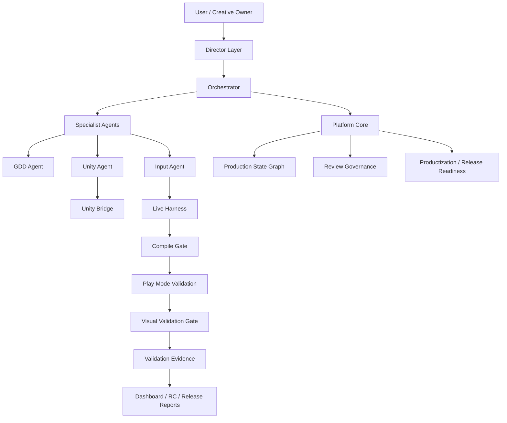

# AInvil

Unity 게임 제작을 위한 evidence 기반 AI workflow platform.

[English](README.md) | [아키텍처](docs/ainvil/ARCHITECTURE.md) | [사례 연구](docs/ainvil/CASE_STUDY_DUNGEON_RECOVERY.md) | [검증 요약](docs/ainvil/VALIDATION.md) | [Quickstart](docs/ainvil/QUICKSTART.md) | [로드맵](docs/ainvil/ROADMAP.md)

---

## AInvil이 무엇인가요?

AInvil은 게임 제작 요청을 추적 가능한 Unity production workflow로 바꾸는 Codex plugin입니다.

단순 Unity Bridge, MCP wrapper, 코드 생성기가 아닙니다. AInvil은 다음 흐름을 하나로 연결합니다.

```text
창작 의도 -> Director 검토 -> Agent 조율 -> Unity 구현
-> Compile Gate -> Play Mode 검증 -> Visual Evidence -> Release Report
```

사용자는 게임의 창작자이자 최종 의사결정자입니다. AInvil은 사용자의 방향을 보존하면서 작업을 구조화하고, 약한 지점을 짚고, 확정된 범위를 구현하고, 실제 동작을 검증하고, evidence를 남깁니다.

## 왜 중요한가요?

많은 AI 코딩 흐름은 스크립트를 생성할 수 있습니다. AInvil은 그보다 어려운 질문을 다룹니다.

> 생성된 Unity 게임이 실제로 컴파일되고, 실행되고, 화면에 올바르게 보이고, release 판단에 사용할 evidence를 남겼는가?

현재 AInvil은 `DungeonRecoveryCompany` 단일 프로젝트 Product MVP 사례로 이 흐름을 검증했습니다.

## 핵심 구조



| 계층 | 역할 |
| --- | --- |
| Director Layer | 게임 비전, 스코프, 플레이어 경험, release 표현의 정직성을 지킵니다. |
| Orchestrator | 기획, 구현, 검증, 리포트를 하나의 작업 흐름으로 조율합니다. |
| GDD Agent | 아이디어를 requirement, task, acceptance criteria, spec으로 정리합니다. |
| Unity Agent | Unity scene, script, prefab, bridge operation, build를 담당합니다. |
| Input Agent | Play Mode, validation probe, 입력 검증, evidence capture를 담당합니다. |
| Platform Core | graph state, review, productization, regression, release report를 관리합니다. |
| Unity Bridge | Codex/AInvil과 실행 중인 Unity Editor를 연결합니다. |

전체 구조 보기: [docs/ainvil/ARCHITECTURE.md](docs/ainvil/ARCHITECTURE.md)

## 현재 검증된 것

| 기능 | 현재 상태 |
| --- | --- |
| Unity Bridge stability | Passed |
| Compile check | Passed |
| Compile Gate safety | Passed |
| Play Mode validation | Passed |
| Visual Validation Gate | Passed |
| Human Playability Review | Passed |
| Build verification | Passed |
| Full regression | 21 passed, 0 failed, 0 blocked |
| Production Core Review | Approved |
| Productization | Release Candidate |
| Release Readiness | Release Ready |
| Public Release Ready | No |

현재 release level:

```text
Core Release Ready / Release Candidate
Product MVP Ready Candidate
Public Release Ready: No
```

검증 요약 보기: [docs/ainvil/VALIDATION.md](docs/ainvil/VALIDATION.md)

## 사례 연구: DungeonRecoveryCompany

AInvil은 `DungeonRecoveryCompany`에서 플레이 가능한 Unity vertical slice를 생성하고 검증했습니다.

검증된 항목:

- first playable recovery job
- 사람의 수동 검토를 통과한 playable build
- procedural dungeon recovery job
- random startup seed와 fixed-seed validation
- 1인칭 조작과 mouse look
- recovery target reachability
- procedural space quality
- screenshot 기반 visual validation
- Windows development build verification

사례 연구 보기: [docs/ainvil/CASE_STUDY_DUNGEON_RECOVERY.md](docs/ainvil/CASE_STUDY_DUNGEON_RECOVERY.md)

## Quickstart

repository root에서 실행합니다.

```powershell
node plugins\ainvil\cli\ainvil-cli.mjs doctor --unity-project <UnityProjectPath>
node plugins\ainvil\cli\ainvil-cli.mjs compile-check --unity-project <UnityProjectPath>
node plugins\ainvil\scripts\run-ainvil-live-harness.mjs --mode probe --scenario ainvil_bridge_smoke_operational
node plugins\ainvil\cli\ainvil-cli.mjs productization
node plugins\ainvil\cli\ainvil-cli.mjs release
```

더 자세한 명령: [docs/ainvil/QUICKSTART.md](docs/ainvil/QUICKSTART.md)

## AInvil이 아직 주장하지 않는 것

AInvil은 현재 다음을 주장하지 않습니다.

- Public Release Ready
- 상용 완성 게임
- 모든 Unity 프로젝트에서 검증 완료
- 완전 자동 게임 제작
- 인간 검토 불필요

release level 정의: [docs/ainvil/RELEASE_LEVELS.md](docs/ainvil/RELEASE_LEVELS.md)

## 저장소 구조

```text
plugins/ainvil/              Codex plugin, skills, CLI, core, harness, evidence
plugins/ainvil/unity-package Canonical Unity Bridge package
UnityPackage/                Deprecated mirror / install artifact
docs/ainvil/                 GitHub 독자를 위한 main 문서
```

## 문서

- [아키텍처](docs/ainvil/ARCHITECTURE.md)
- [DungeonRecoveryCompany 사례 연구](docs/ainvil/CASE_STUDY_DUNGEON_RECOVERY.md)
- [검증 요약](docs/ainvil/VALIDATION.md)
- [Quickstart](docs/ainvil/QUICKSTART.md)
- [Release Level 정의](docs/ainvil/RELEASE_LEVELS.md)
- [로드맵](docs/ainvil/ROADMAP.md)

## 요약

AInvil은 현재 evidence 기반 Unity 게임 개발 workflow를 증명합니다. 플레이 가능한 vertical slice를 생성하고, Play Mode에서 runtime behavior를 검증하며, visual evidence를 캡처하고, compile 및 environment blocker를 분리하며, release-readiness report까지 생성할 수 있습니다. 아직 public release 제품은 아니지만, `DungeonRecoveryCompany` 사례를 통해 Product MVP Ready Candidate 상태에 도달했습니다.
