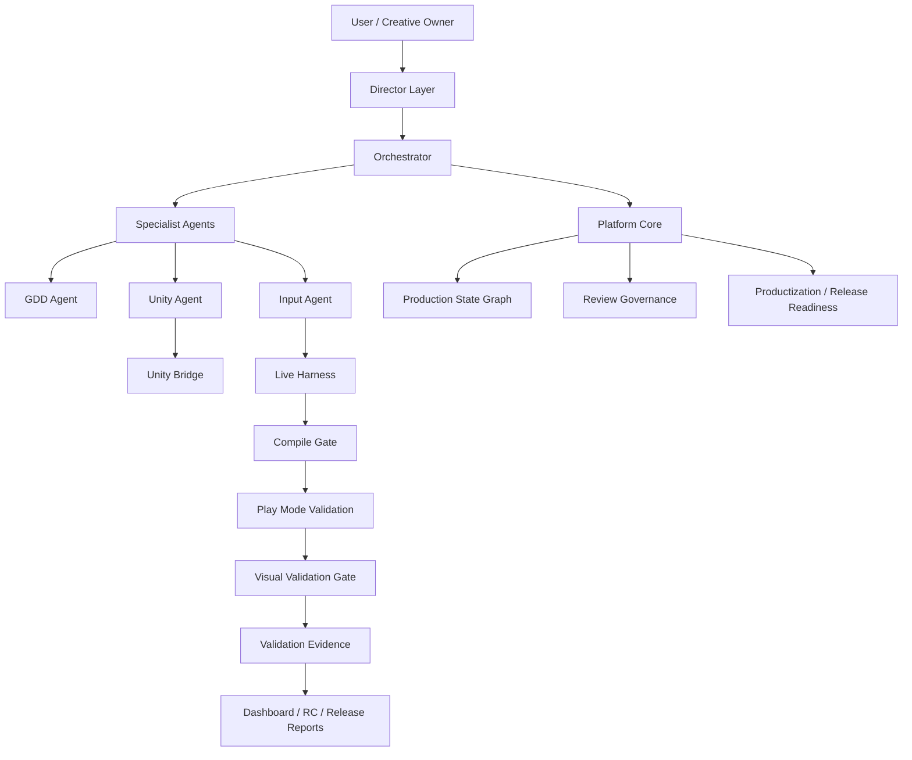

# AInvil

Evidence-grounded AI workflow platform for Unity game production.

[Korean](README.ko.md) | [Architecture](docs/ainvil/ARCHITECTURE.md) | [Case Study](docs/ainvil/CASE_STUDY_DUNGEON_RECOVERY.md) | [Validation](docs/ainvil/VALIDATION.md) | [Quickstart](docs/ainvil/QUICKSTART.md) | [Roadmap](docs/ainvil/ROADMAP.md)

---

## What It Is

AInvil is a Codex plugin that turns a game development request into a traceable Unity production workflow.

It is not just a Unity bridge, MCP wrapper, or code generator. AInvil keeps the chain intact:

```text
Creative intent -> Director review -> Agent orchestration -> Unity implementation
-> Compile gate -> Play Mode validation -> Visual evidence -> Release reports
```

The user remains the creative owner. AInvil structures the work, challenges weak spots, implements confirmed scope, validates real behavior, and records evidence.

## Why It Matters

Most AI coding flows can generate scripts. AInvil is built around the harder question:

> Did the generated Unity game actually compile, run, show the right thing on screen, and produce evidence that supports a release decision?

AInvil currently demonstrates this with `DungeonRecoveryCompany`, a single-project Product MVP case study.

## Core Architecture



| Layer | Role |
| --- | --- |
| Director Layer | Protects vision, scope, player experience, and release honesty. |
| Orchestrator | Routes work across planning, implementation, validation, and reports. |
| GDD Agent | Turns ideas into requirements, tasks, acceptance criteria, and specs. |
| Unity Agent | Creates Unity scenes, scripts, prefabs, bridge operations, and builds. |
| Input Agent | Runs Play Mode checks, validation probes, input checks, and evidence capture. |
| Platform Core | Maintains graph state, reviews, productization, regression, and release reports. |
| Unity Bridge | Connects Codex/AInvil to the running Unity Editor. |

Read the full architecture: [docs/ainvil/ARCHITECTURE.md](docs/ainvil/ARCHITECTURE.md)

## Verified Today

| Capability | Current Status |
| --- | --- |
| Unity Bridge stability | Passed |
| Compile check | Passed |
| Compile Gate safety | Passed |
| Play Mode validation | Passed |
| Visual Validation Gate | Passed |
| Human Playability Review | Passed |
| Build verification | Passed |
| Full regression | 21 passed, 0 failed, 0 blocked |
| Production Core Review | Approved |
| Productization | Release Candidate |
| Release Readiness | Release Ready |
| Public Release Ready | No |

Current release level:

```text
Core Release Ready / Release Candidate
Product MVP Ready Candidate
Public Release Ready: No
```

Read the validation summary: [docs/ainvil/VALIDATION.md](docs/ainvil/VALIDATION.md)

## Case Study: DungeonRecoveryCompany

AInvil generated and validated a playable Unity vertical slice for `DungeonRecoveryCompany`.

Verified in the case study:

- first playable recovery job
- human-reviewed playable build
- procedural dungeon recovery job
- random startup seed and fixed-seed validation
- first-person control and mouse look
- target reachability checks
- procedural space quality checks
- screenshot-based visual validation
- Windows development build verification

Read the case study: [docs/ainvil/CASE_STUDY_DUNGEON_RECOVERY.md](docs/ainvil/CASE_STUDY_DUNGEON_RECOVERY.md)

## Quickstart

From the repository root:

```powershell
node plugins\ainvil\cli\ainvil-cli.mjs doctor --unity-project <UnityProjectPath>
node plugins\ainvil\cli\ainvil-cli.mjs compile-check --unity-project <UnityProjectPath>
node plugins\ainvil\scripts\run-ainvil-live-harness.mjs --mode probe --scenario ainvil_bridge_smoke_operational
node plugins\ainvil\cli\ainvil-cli.mjs productization
node plugins\ainvil\cli\ainvil-cli.mjs release
```

More commands: [docs/ainvil/QUICKSTART.md](docs/ainvil/QUICKSTART.md)

## What AInvil Is Not

AInvil does not currently claim:

- public release readiness
- a production-finished commercial game
- verification across all Unity projects
- fully automatic game production
- that human review is unnecessary

See release-level definitions: [docs/ainvil/RELEASE_LEVELS.md](docs/ainvil/RELEASE_LEVELS.md)

## Repository Map

```text
plugins/ainvil/              Codex plugin, skills, CLI, core, harness, evidence
plugins/ainvil/unity-package Canonical Unity Bridge package
UnityPackage/                Deprecated mirror / install artifact
docs/ainvil/                 Main documentation for GitHub readers
```

## Documentation

- [Architecture](docs/ainvil/ARCHITECTURE.md)
- [DungeonRecoveryCompany Case Study](docs/ainvil/CASE_STUDY_DUNGEON_RECOVERY.md)
- [Validation Summary](docs/ainvil/VALIDATION.md)
- [Quickstart](docs/ainvil/QUICKSTART.md)
- [Release Levels](docs/ainvil/RELEASE_LEVELS.md)
- [Roadmap](docs/ainvil/ROADMAP.md)

## Summary

AInvil currently demonstrates an evidence-grounded Unity game development workflow: it can generate a playable vertical slice, validate runtime behavior through Play Mode, capture visual evidence, detect compile and environment blockers, and produce release-readiness reports. It is not yet a public-release product, but it has reached a Product MVP Ready Candidate state through the `DungeonRecoveryCompany` case study.
