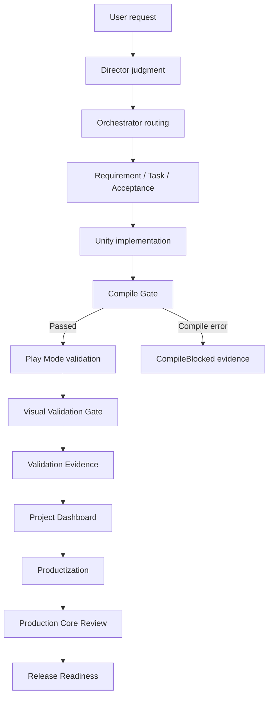

# AInvil Architecture

[Back to README](../../README.md)

## Overview

AInvil is organized as a layered Unity game production workflow. The key distinction is that AInvil has a Director Layer above implementation agents. The Director Layer protects the game direction, while the Orchestrator and specialist agents execute production work.

```text
User
  -> Director Layer
    -> Orchestrator
      -> GDD Agent
      -> Unity Agent
      -> Input Agent
    -> Platform Core
    -> Unity Integration Layer
    -> Validation Evidence
    -> Dashboard / Release Reports
```

## Director Layer

The Director Layer is the high-level judgment layer. It does not directly edit Unity scenes, generate scripts, or run Play Mode. It evaluates whether current work still supports the intended game.

It owns:

- game vision
- core fantasy
- core loop quality
- player experience
- scope control
- design drift detection
- milestone readiness
- release honesty

For `DungeonRecoveryCompany`, Director-level questions include:

- Does this still feel like a recovery company game?
- Is the vertical slice understandable as a first playable?
- Is the prototype becoming only an input test?
- What gameplay loop should come next?
- Is it honest to call this Public Release Ready?

## Orchestrator

The Orchestrator turns Director judgment into routed production work.

Responsibilities:

- interpret the latest user intent
- inspect production state
- route work to GDD, Unity, and Input agents
- keep requirements, implementation, and validation linked
- check evidence before status promotion
- update dashboard, productization, review, and release reports

## Specialist Agents

| Agent | Responsibility |
| --- | --- |
| GDD Agent | GDD, system design, feature specs, requirements, tasks, acceptance criteria. |
| Unity Agent | Scenes, prefabs, GameObjects, scripts, materials, bridge operations, builds. |
| Input Agent | Play Mode validation, input simulation, validation probes, evidence, playability review. |

## Platform Core

Platform Core is the durable production layer.

| Component | Purpose |
| --- | --- |
| Production State Graph | Connects vision, requirements, tasks, Unity targets, acceptance criteria, and evidence. |
| Production Intelligence | Reads graph/report state and highlights risk, coverage, and next actions. |
| Review Governance | Stores structured review records and release gate decisions. |
| Workflow Runtime | Synchronizes operational artifacts. |
| Productization | Classifies features as Verified, Partial, Blocked, Spec-only, or Deprecated/Sample. |
| Release Readiness | Determines release state and blockers from evidence and reviews. |
| Regression Suite | Rechecks the current release candidate against offline and live gates. |
| Dashboard / Reports | Produces readable state summaries. |

## Unity Integration Layer

| Component | Purpose |
| --- | --- |
| MCP Unity Server | Proxies Codex/AInvil requests to Unity Bridge. |
| Unity Bridge Package | Canonical Unity-side package installed in a Unity project. |
| Unity Editor Bridge | HTTP/RPC server running inside Unity Editor. |
| Live Harness | Runs operational validation scenarios. |
| Compile Gate | Blocks Play Mode when compile errors exist. |
| Play Mode Validation | Verifies runtime behavior in Unity. |
| Visual Validation Gate | Captures screenshots and checks camera/UI/shader issues. |
| Input Test Bridge | Supports validation hooks and input checks. |

Canonical Unity Bridge package:

```text
plugins/ainvil/unity-package/Packages/com.codex.unity-bridge
```

The root-level `UnityPackage/` directory is a deprecated mirror/install artifact.

## End-to-End Workflow



## Failure Classification

| Failure Class | Meaning |
| --- | --- |
| `CompileBlocked` | C# compile errors prevent Play Mode. |
| `EnvironmentBlocked` | Unity Editor, Bridge, port, package, or workspace environment blocks validation. |
| `ProductValidationFailed` | The scenario ran, but acceptance criteria failed. |

This separation prevents a disconnected Unity Bridge from being treated as a product failure.
