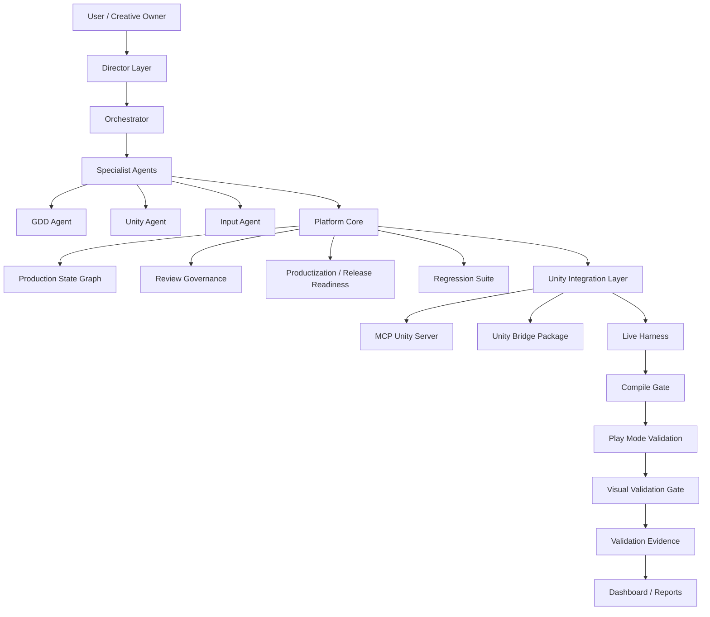

[English](README.md) | [한국어](README.ko.md)

# AInvil

**AInvil** is an evidence-grounded Unity game production agent workflow platform packaged as a Codex plugin.

AInvil is not just a Unity MCP wrapper or a code generator. It is a layered AI game production system that connects:

```text
User creative intent
→ Director-level judgment
→ Orchestrated specialist agents
→ GDD / technical planning
→ Unity implementation
→ Compile Gate
→ Play Mode validation
→ Visual Validation
→ Evidence
→ Dashboard / Productization / Release Readiness
```

The current validated case study is **DungeonRecoveryCompany**, where AInvil generated, validated, and built a playable procedural dungeon recovery prototype.

---

## Current Status

AInvil is currently classified as:

| Level                                   | Status |
| --------------------------------------- | ------ |
| Core Release Ready / Release Candidate  | Yes    |
| Core RC Reproducibility Verified        | Yes    |
| Canonical Unity Bridge Package Verified | Yes    |
| Product MVP Ready Candidate             | Yes    |
| Public Release Ready                    | No     |

This means AInvil has demonstrated a working Unity game production workflow in a single validated project case study.

It does **not** mean AInvil is ready for public distribution, general-user installation, or universal use across all Unity projects.

---

## What AInvil Proves Today

AInvil currently demonstrates that an AI agent workflow can:

* Convert a user game request into Feature / Requirement / Task / Acceptance Criteria.
* Generate Unity gameplay code and scenes.
* Run compile checks before Play Mode.
* Validate runtime behavior through Unity Play Mode.
* Capture visual evidence from the GameView.
* Distinguish product failures from compile failures and environment failures.
* Preserve LastKnownPassed evidence when live revalidation is blocked.
* Generate evidence, dashboards, productization reports, and release-readiness decisions.
* Build a playable Windows development build.

The current proof is a **single-project Product MVP case study**, not a universal benchmark.

---

## Verified Capabilities

| Capability                        | Status                         |
| --------------------------------- | ------------------------------ |
| Unity Bridge smoke validation     | Passed                         |
| Compile Check                     | Passed                         |
| Compile Gate Safety               | Passed                         |
| First Playable E2E                | Passed                         |
| Human Playability Review          | Passed                         |
| Procedural Recovery Job           | Passed                         |
| Random Startup Seed               | Passed                         |
| Fixed Seed Determinism            | Passed                         |
| First Person Control / Mouse Look | Passed                         |
| Procedural Space Quality          | Passed                         |
| Visual Validation Gate            | Passed                         |
| Windows Build Verification        | Passed                         |
| Full Regression                   | 21 passed, 0 failed, 0 blocked |
| Production Core Review            | Approved                       |
| Productization                    | Release Candidate              |
| Release Readiness                 | Release Ready                  |
| Public Release Ready              | No                             |

---

## Case Study: DungeonRecoveryCompany

`DungeonRecoveryCompany` is the current AInvil Product MVP case study.

AInvil generated and validated:

* A first playable recovery job.
* A human-reviewed playable build.
* A procedural dungeon recovery job.
* Random startup seed generation.
* Fixed-seed deterministic generation.
* First-person movement and mouse look.
* Random recovery target placement.
* Target reachability validation.
* Larger dungeon rooms, wider corridors, higher walls, and primitive props.
* Procedural space quality validation.
* Visual validation with screenshot evidence.
* Windows development build verification.

Latest procedural validation highlights:

| Metric                             | Result                 |
| ---------------------------------- | ---------------------- |
| Fixed test seeds                   | `1001`, `2026`, `7777` |
| Random startup seed                | Verified               |
| Same-seed deterministic generation | Verified               |
| Different-seed layout variation    | Verified               |
| Corridor width                     | `3`                    |
| Wall height                        | `3.2`                  |
| Reachable targets                  | `3 / 3`                |
| Blocked doorways                   | `0`                    |
| Blocked targets                    | `0`                    |
| Console errors                     | `0`                    |

Key evidence files:

```text
validation/evidence/EVID-ainvil-bridge-smoke-operational-latest.json
validation/evidence/EVID-dungeon-recovery-first-playable-e2e-latest.json
validation/evidence/EVID-dungeon-recovery-first-playable-human-playability-latest.json
validation/evidence/EVID-dungeon-recovery-procedural-recovery-job-e2e-latest.json
validation/evidence/EVID-dungeon-recovery-procedural-space-quality-latest.json
validation/evidence/EVID-dungeon-recovery-procedural-visual-validation-latest.json
validation/evidence/EVID-ainvil-compile-gate-blocks-playmode-latest.json
```

---

## Architecture

AInvil is organized as a layered production system.

```text
User
  ↓
Director Layer
  ↓
Orchestrator
  ↓
Specialist Agents
  ├─ GDD Agent
  ├─ Unity Agent
  └─ Input Agent
  ↓
Platform Core
  ├─ Production State Graph
  ├─ Production Intelligence
  ├─ Review Governance
  ├─ Workflow Runtime
  ├─ Productization
  ├─ Release Readiness
  ├─ Regression Suite
  └─ Dashboard / Reports
  ↓
Unity Integration Layer
  ├─ MCP Unity Server
  ├─ Unity Bridge Package
  ├─ Unity Editor Bridge
  ├─ Live Harness
  ├─ Compile Gate
  ├─ Play Mode Validation
  └─ Visual Validation Gate
  ↓
Validation Evidence
  ├─ Scenario Evidence
  ├─ Screenshot Evidence
  ├─ Build Verification
  ├─ Human Playability Review
  └─ Release / RC Reports
```

Mermaid version:



---

## Layer Overview

### 1. User Layer

The user is the creative owner and final decision-maker.

AInvil starts from the user's game idea or production request and turns it into production artifacts:

```text
Idea
→ Design Intent
→ Feature
→ Requirement
→ Task
→ Acceptance Criteria
→ Unity Implementation
→ Validation Evidence
```

AInvil must preserve the user's creative direction instead of silently replacing it.

---

### 2. Director Layer

The Director Layer is AInvil's high-level judgment layer.

It does not directly modify Unity scenes, generate scripts, edit prefabs, or run Play Mode. Instead, it evaluates whether the current work aligns with the intended game and production goals.

The Director Layer watches:

* Game vision
* Core fantasy
* Core loop
* Player experience
* Design quality
* Scope control
* Design drift
* Project health
* Validation coverage
* Release risk

Example Director questions for `DungeonRecoveryCompany`:

* Does this still feel like a recovery company game?
* Is the vertical slice playable and understandable?
* Is this becoming only an input test instead of a game?
* What is the next gameplay loop?
* Is it honest to call this Public Release Ready?

---

### 3. Orchestrator

The Orchestrator converts Director-level judgment into actual production work.

Responsibilities:

* Interpret user requests.
* Read the current production state.
* Route work to specialist agents.
* Connect design, implementation, and validation.
* Check evidence.
* Refresh dashboards and reports.
* Decide the next action.

Example:

```text
User: "Change the procedural dungeon to first-person view."

Orchestrator:
1. Recognizes gameplay/camera impact.
2. Checks affected requirements and acceptance criteria.
3. Routes implementation to Unity Agent.
4. Routes validation to Input Agent.
5. Checks Play Mode and visual evidence.
6. Updates productization and release status.
```

---

### 4. Specialist Agents

AInvil separates production responsibilities into specialist agents.

#### GDD Agent

Responsible for:

* GDD
* System Design
* Technical Design
* Feature Spec
* Requirement
* Task
* Acceptance Criteria
* Design Decision

It turns vague user ideas into production-ready specifications.

#### Unity Agent

Responsible for:

* Scene creation
* Prefabs
* GameObjects
* Components
* Scripts
* Materials
* Unity Bridge operations
* Build verification

In the `DungeonRecoveryCompany` case study, the Unity Agent generated:

```text
Assets/AInvilGenerated/DungeonRecoveryFirstPlayable/
```

Including:

* First playable scene
* Procedural recovery job scene
* Player controller
* First-person camera
* Mouse look
* Recovery targets
* Room / corridor generation
* Primitive props
* Visual validation probe

#### Input Agent

Responsible for:

* Play Mode entry
* Input simulation
* Validation probe calls
* Interaction validation
* UI state checks
* Screenshot evidence checks
* Human playability review integration

The Input Agent verifies that the feature actually works in play, not just that code exists.

---

## Platform Core

Platform Core makes AInvil more than a chat-based coding assistant.

It provides persistent state, review governance, productization status, regression checks, and release judgment.

Main components:

| Component               | Purpose                                                                             |
| ----------------------- | ----------------------------------------------------------------------------------- |
| Production State Graph  | Tracks Vision → Feature → Requirement → Task → Unity Target → Acceptance → Evidence |
| Production Intelligence | Reads graph state and identifies risks / next actions                               |
| Review Governance       | Manages Production Core Review and release gate reviews                             |
| Workflow Runtime        | Synchronizes operational artifacts                                                  |
| Productization          | Classifies capabilities as Verified / Partial / Blocked / Spec-only / Deprecated    |
| Release Readiness       | Evaluates release status and blockers                                               |
| Regression Suite        | Runs offline/live validation suites                                                 |
| Dashboard / Reports     | Generates human-readable project status                                             |
| RC Baseline             | Captures release candidate state                                                    |

---

## Unity Integration Layer

The Unity Integration Layer connects AInvil to the actual Unity Editor.

Components:

| Component              | Purpose                                                    |
| ---------------------- | ---------------------------------------------------------- |
| MCP Unity Server       | Proxies Codex/AInvil calls to Unity Bridge                 |
| Unity Bridge Package   | Unity-side bridge package installed into the Unity project |
| Unity Editor Bridge    | HTTP/RPC server running inside Unity Editor                |
| Live Harness           | Executes operational validation scenarios                  |
| Compile Gate           | Blocks Play Mode when compile errors exist                 |
| Play Mode Validation   | Verifies runtime behavior in Unity                         |
| Visual Validation Gate | Captures screenshots and checks screen/camera issues       |
| Input Test Bridge      | Supports input and validation hooks                        |

Canonical Unity Bridge package:

```text
plugins/ainvil/unity-package/Packages/com.codex.unity-bridge
```

The root-level `UnityPackage/` directory is a deprecated mirror/install artifact.

---

## Validation Pipeline

AInvil's current operational validation flow:

```text
User request
  → Director judgment
  → Orchestrator routing
  → GDD / Requirement / Acceptance
  → Unity implementation
  → Asset refresh
  → Compile Gate
  → Play Mode validation
  → Visual Validation Gate
  → Validation Evidence
  → Dashboard / Productization / Review
  → Release Readiness
```

---

## Failure Classification

AInvil separates validation failures into distinct classes.

| Failure Class                                    | Meaning                                         | Expected Behavior                                              |
| ------------------------------------------------ | ----------------------------------------------- | -------------------------------------------------------------- |
| `CompileBlocked`                                 | C# compile errors prevent Play Mode             | Do not enter Play Mode. Report file, line, code, and message.  |
| `EnvironmentBlocked` / `UnityBridgeDisconnected` | Unity Bridge or environment prevents validation | Preserve LastKnownPassed evidence. Mark Revalidation Required. |
| `ProductValidationFailed`                        | Validation ran and acceptance failed            | Mark product scenario failed and report failed assertions.     |

This prevents environment issues from being misreported as product failures.

---

## Compile Gate Safety

Every Play Mode validation must pass through Compile Gate first.

Compile Gate checks:

* Unity Bridge health
* Unity project path
* Asset refresh / compilation state
* Unity compile status
* Unity console errors
* Local `Assembly-CSharp.csproj` C# build check

Verified safety behavior:

```text
Intentional compile error created
→ Compile Gate detected CS0103
→ Play Mode was not attempted
→ downstream runtime validation was skipped
→ temporary error file was deleted
→ compile check passed after cleanup
```

Evidence:

```text
validation/evidence/EVID-ainvil-compile-gate-blocks-playmode-latest.json
```

---

## Visual Validation Gate

Runtime logic can pass even when the actual game screen is broken.

Visual Validation catches screen-level failures such as:

* Camera looking at the wrong area
* Player/targets not visible
* First-person camera placed incorrectly
* UI outside the screen
* Missing shader / magenta rendering
* Interaction prompt not visible
* Job complete UI not visible

Visual Validation checks:

* GameView screenshot capture
* Active camera validity
* First-person camera mode
* Camera framing
* Player movement
* Mouse look
* UI visibility
* Interaction prompt visibility
* Missing shader / magenta pixel detection
* Console error count

Screenshot evidence is stored under:

```text
reports/visual_review/screenshots/
```

Visual Validation does not replace human playability review. It catches obvious visual and camera problems before human review.

---

## Validation Evidence

AInvil's core output is evidence, not just a claim that something worked.

Evidence types:

* Operational scenario evidence
* Compile evidence
* Play Mode evidence
* Visual screenshot evidence
* Build verification evidence
* Human playability review
* Regression report
* RC baseline manifest
* Release readiness report

Evidence usually includes:

* scenarioId
* classification
* result
* validationLevel
* startedAt / completedAt
* checked steps
* console error summary
* failure reason
* blocker type
* next action

AInvil separates:

* latest run
* latest passed evidence
* latest blocked evidence
* latest failed evidence

This allows AInvil to preserve `LastKnownPassed` while still reporting `CurrentRunBlocked`.

---

## Plugin Entry Points

| Entry Point   | Path                                            | Purpose                                                                  |
| ------------- | ----------------------------------------------- | ------------------------------------------------------------------------ |
| Manifest      | `.codex-plugin/plugin.json`                     | Codex plugin metadata, skill registration, MCP registration              |
| Skills        | `skills/`                                       | Director, Orchestrator, GDD Agent, Unity Agent, Input Agent instructions |
| MCP config    | `.mcp.json`                                     | Registers Unity Bridge MCP server                                        |
| MCP server    | `mcp-server/server.mjs`                         | Proxies MCP calls to the local Unity Bridge HTTP endpoint                |
| Unity package | `unity-package/Packages/com.codex.unity-bridge` | Canonical Unity-side bridge package                                      |
| Platform core | `core/`                                         | Review, productization, release, regression, runtime synchronization     |
| CLI           | `cli/ainvil-cli.mjs`                            | Non-Codex entry point for inspection, validation, and reporting          |
| Harness       | `harness/`                                      | Operational and sample validation scenarios                              |
| Evidence      | `validation/evidence/`                          | Runtime, visual, build, and safety evidence                              |
| Reports       | `reports/`                                      | Dashboard, productization, release, regression, RC reports               |

---

## Unity Requirements

Unity integration requires:

* Node.js available as `node`
* Unity 2021.3 or newer
* Canonical Unity Bridge package installed from:

```text
plugins/ainvil/unity-package/Packages/com.codex.unity-bridge
```

Example Unity `manifest.json` dependency:

```text
file:E:/wiseongjun/ProgrammingNAssignment/GameDesigner/plugins/ainvil/unity-package/Packages/com.codex.unity-bridge
```

Unity Bridge endpoint:

```text
http://127.0.0.1:17777/rpc
```

Platform and CLI inspection features do not require Unity.
Live validation, Play Mode validation, Visual Validation, and Build Verification require Unity Bridge.

---

## Quickstart: Core RC Verification

Run from the repository root.

```powershell
node plugins\ainvil\cli\ainvil-cli.mjs doctor --unity-project <UnityProjectPath>
node plugins\ainvil\cli\ainvil-cli.mjs compile-check --unity-project <UnityProjectPath>
node plugins\ainvil\scripts\run-ainvil-live-harness.mjs --mode probe --scenario ainvil_bridge_smoke_operational
node plugins\ainvil\cli\ainvil-cli.mjs review
node plugins\ainvil\cli\ainvil-cli.mjs productization
node plugins\ainvil\cli\ainvil-cli.mjs release
```

Generate the RC baseline:

```powershell
node plugins\ainvil\cli\ainvil-cli.mjs rc
```

Run offline regression:

```powershell
node plugins\ainvil\cli\ainvil-cli.mjs regression
```

Run live smoke regression when Unity Bridge is running:

```powershell
node plugins\ainvil\cli\ainvil-cli.mjs regression --live-smoke --unity-project <UnityProjectPath>
```

---

## Quickstart: Product MVP Revalidation

For the `DungeonRecoveryCompany` procedural vertical slice:

```powershell
node plugins\ainvil\cli\ainvil-cli.mjs doctor --unity-project E:\wiseongjun\Unity\DungeonRecoveryCompany
node plugins\ainvil\cli\ainvil-cli.mjs compile-check --unity-project E:\wiseongjun\Unity\DungeonRecoveryCompany
node plugins\ainvil\scripts\run-ainvil-live-harness.mjs --mode probe --scenario ainvil_bridge_smoke_operational
node plugins\ainvil\scripts\run-ainvil-live-harness.mjs --mode probe --scenario dungeon_recovery_procedural_space_quality_validation
node plugins\ainvil\scripts\run-ainvil-live-harness.mjs --mode probe --scenario dungeon_recovery_procedural_visual_validation
node plugins\ainvil\cli\ainvil-cli.mjs regression --procedural --visual --space-quality --build --unity-project E:\wiseongjun\Unity\DungeonRecoveryCompany
node plugins\ainvil\cli\ainvil-cli.mjs review
node plugins\ainvil\cli\ainvil-cli.mjs productization
node plugins\ainvil\cli\ainvil-cli.mjs release
```

Expected result:

```text
Unity Bridge Stability: Passed
Compile Check: Passed
Procedural Space Quality: Passed
Visual Validation: Passed
Regression: Passed
Production Core Review: Approved
Productization: Release Candidate
Release Readiness: Release Ready
Public Release Ready: No
```

---

## Local Validation

Run these checks from the repository root:

```powershell
node plugins\ainvil\scripts\generate-benchmark-report.mjs
node plugins\ainvil\scripts\validate-benchmark-report.mjs
node plugins\ainvil\scripts\validate-ainvil-plugin.mjs
node plugins\ainvil\scripts\validate-ainvil-cli.mjs
node plugins\ainvil\scripts\validate-ainvil-harness.mjs
node plugins\ainvil\scripts\validate-validation-evidence.mjs
node plugins\ainvil\scripts\validate-project-dashboard.mjs
node plugins\ainvil\scripts\validate-release-readiness-report.mjs
node plugins\ainvil\scripts\validate-review-records.mjs
node plugins\ainvil\scripts\validate-production-state-graph.mjs
```

Useful CLI checks:

```powershell
node plugins\ainvil\cli\ainvil-cli.mjs status
node plugins\ainvil\cli\ainvil-cli.mjs workflow
node plugins\ainvil\cli\ainvil-cli.mjs transitions
node plugins\ainvil\cli\ainvil-cli.mjs approvals
node plugins\ainvil\cli\ainvil-cli.mjs executions
node plugins\ainvil\cli\ainvil-cli.mjs doctor --unity-project <UnityProjectPath>
node plugins\ainvil\cli\ainvil-cli.mjs compile-check --unity-project <UnityProjectPath>
node plugins\ainvil\cli\ainvil-cli.mjs productization
node plugins\ainvil\cli\ainvil-cli.mjs review
node plugins\ainvil\cli\ainvil-cli.mjs release
node plugins\ainvil\cli\ainvil-cli.mjs rc
```

---

## Productization Reports

Use the productization report to separate design-time capability from verified runtime behavior.

```powershell
node plugins\ainvil\cli\ainvil-cli.mjs init-production-graph
node plugins\ainvil\cli\ainvil-cli.mjs productization
```

Reports:

```text
reports/productization_status_report.json
reports/productization_status_report.md
reports/release_readiness_report.json
reports/rc_baseline_manifest.json
reports/regression_suite_latest.json
reports/project_dashboard.json
```

Example harness fixtures such as `top_down_collectible` are retained for benchmark/sample use, but they must not satisfy operational release gates for a real project.

---

## Documentation

Recommended documents:

```text
docs/AInvil_Core_RC_Quickstart.md
docs/AInvil_Fresh_Workspace_Verification.md
docs/AInvil_Release_Level_Definitions.md
docs/AInvil_Portfolio_Case_Study.md
docs/AInvil_Technical_Architecture.md
docs/AInvil_Validation_Summary.md
docs/AInvil_Research_Paper_Draft.md
docs/AInvil_Roadmap.md
```

---

## Known Limitations

AInvil does not currently claim:

* Public Release Ready
* A production-finished commercial game
* Verification across all Unity projects
* Fully automatic game production
* That human review is unnecessary
* Long-session stability
* Production-level art, sound, tutorial, save/load, balance, or onboarding
* Public installer or polished user-facing setup

Known remaining gaps:

* Public installation polish
* Long-session stability
* Multi-project benchmark coverage
* Bridge watchdog / auto-recovery
* Richer onboarding
* Extraction / return-to-company loop
* Reward / company funds loop
* Save/load
* Production-level art, sound, tutorial, and reward progression

---

## Roadmap

Next planned work:

1. Extraction / Return-to-Company loop
2. Reward / company funds loop
3. Save/load
4. Longer playability tests
5. Bridge watchdog / auto-recovery
6. Better install experience
7. Public release packaging
8. Multi-project validation benchmark

See:

```text
docs/AInvil_Roadmap.md
```

---

## Platform Boundary

The current plugin intentionally keeps the platform core inside the plugin directory. This proves AInvil can run as a Codex plugin while also exposing reusable read-only platform logic for future CLI, desktop, web, or service clients.

Future extraction should preserve this boundary:

* `core/` remains client-neutral.
* `cli/` remains a thin client over `core/`.
* `skills/` remain Codex-facing agent instructions.
* `mcp-server/` and `unity-package/` remain Unity integration surfaces.
* `validation/evidence/` remains the evidence layer for traceable validation results.
* `reports/` remains the generated reporting layer.

---

## Summary

AInvil currently demonstrates an evidence-grounded Unity game development workflow.

It can take a user game request, preserve the user's creative direction through the Director Layer, coordinate planning and implementation through the Orchestrator and specialist agents, generate Unity gameplay, validate the result through Compile Gate, Play Mode, and Visual Validation, preserve evidence, and produce release-readiness reports.

It is not yet a public-release product, but it has reached a **Product MVP Ready Candidate** state through the `DungeonRecoveryCompany` single-project case study.
