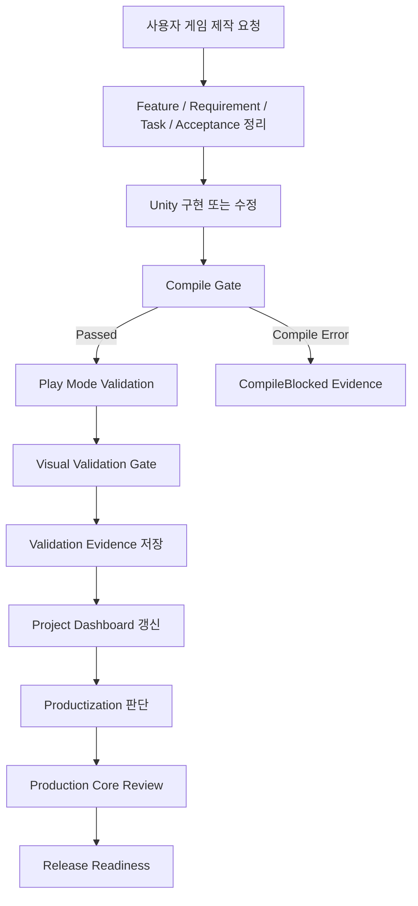

# AInvil Portfolio Case Study: DungeonRecoveryCompany

## 1. 프로젝트 개요

AInvil은 Codex Plugin, Agent Skills, Platform Core, Unity Bridge, Live Harness, Validation Evidence, Dashboard, Release Readiness를 하나의 Unity 게임 제작 워크플로우로 연결하는 AI Agent Workflow Platform이다.

현재 검증된 대표 사례는 `DungeonRecoveryCompany`이다. 이 사례에서 AInvil은 사용자의 게임 제작 요청을 받아 첫 플레이어블 vertical slice를 생성하고, 이후 procedural recovery job으로 확장한 뒤, Unity Play Mode와 빌드 검증, 시각 검증, 공간 품질 검증, release readiness 판단까지 evidence 기반으로 연결했다.

이 문서는 포트폴리오용 사례 정리이다. Public Release Ready 또는 상용 완성 게임을 주장하지 않는다.

## 2. 문제 정의

일반적인 코드 생성형 AI는 Unity 스크립트나 씬 구성 일부를 만들 수 있지만, 다음 문제가 남기 쉽다.

- 생성된 기능이 실제 Unity Editor에서 컴파일되는지 불명확하다.
- Play Mode에서 사용자가 의도한 루프가 동작하는지 evidence가 없다.
- 카메라, UI, 셰이더, 화면 구도 같은 시각 문제를 놓칠 수 있다.
- Unity Bridge 연결 실패와 제품 기능 실패가 섞여 잘못 판단될 수 있다.
- 검증 결과가 dashboard, release report, review gate까지 이어지지 않는다.

AInvil의 목표는 "코드를 만들었다"가 아니라 "요청, 기획, 구현, 검증, evidence, dashboard, release 판단이 추적 가능한 workflow로 이어졌다"를 증명하는 것이다.

## 3. AInvil의 목표

AInvil은 단순 Unity MCP wrapper가 아니라 게임 제작 workflow를 다루는 플랫폼이다.

- 사용자 의도를 feature, requirement, task, acceptance criteria로 정리한다.
- Unity 구현을 생성하거나 수정한다.
- Compile Gate를 통해 compile error가 있으면 Play Mode 검증을 막는다.
- Live Harness로 Unity Bridge, Play Mode, hierarchy, console, validation probe를 호출한다.
- Evidence JSON과 Markdown/JSON report를 저장한다.
- Productization, Review, RC, Release Readiness 판단에 evidence를 반영한다.
- 실패를 `Failed`, 환경 문제를 `EnvironmentBlocked`, compile 문제를 `CompileBlocked`로 분리한다.

## 4. 시스템 구조

AInvil의 현재 구조는 다음 계층으로 나뉜다.

- Codex Plugin Layer: `.codex-plugin/plugin.json`, skills, MCP registration.
- Agent Skills Layer: Orchestrator, GDD Agent, Unity Agent, Input Agent.
- Platform Core: productization, review, release readiness, regression, workspace audit.
- Unity Bridge: Unity Editor와 HTTP/RPC로 통신하는 canonical package.
- Live Harness: operational scenario를 실행하고 evidence를 저장한다.
- Validation Evidence: scenario별 결과, steps, console summary, failure class, next action.
- Dashboard/Reports: project dashboard, productization report, RC manifest, release readiness report.

Canonical Unity Bridge package path:

```text
plugins/ainvil/unity-package/Packages/com.codex.unity-bridge
```

## 5. 게임 제작 Workflow



## 6. DungeonRecoveryCompany 검증 사례

### First Playable

첫 단계에서는 `DungeonRecoveryCompany`에 복구 대상 3개를 찾아 회수하는 vertical slice를 생성했다. 이 단계는 다음을 포함했다.

- 플레이어 이동
- 복구 대상 3개
- 상호작용 키
- 진행도 UI
- Job Complete 상태
- Windows build verification
- Human Playability Review

초기 수동 검토에서는 카메라와 가시성 문제가 발견되어 `Needs Improvement`로 기록했다. 이후 카메라 framing, 시각 대비, 라벨, 상호작용 안내를 최소 수정했고, 사용자의 수동 재검토 결과 `Passed`로 갱신했다.

### Procedural Recovery Job

두 번째 단계에서는 특정 고정 배치가 아니라 procedural recovery job으로 확장했다.

- 실행 시작 시 random startup seed를 배정한다.
- 검증에서는 fixed seed determinism을 위해 `1001`, `2026`, `7777`을 사용한다.
- 1인칭 시야와 mouse look을 적용한다.
- procedural room, corridor, wall, prop, recovery target 배치를 검증한다.
- target 3개가 reachable한지 Play Mode에서 확인한다.

### Visual Validation Gate

시각 검증은 logic validation만으로는 발견하기 어려운 문제를 잡기 위해 추가되었다.

- screenshot evidence 생성
- first-person camera framing 확인
- mouse look 확인
- player movement 확인
- missing shader 또는 magenta 화면 감지
- UI visibility 확인

### Compile Gate Safety

컴파일 에러가 있을 때 Play Mode에 진입하려는 문제가 발견되어 Compile Gate를 추가했다.

- Unity compile status 확인
- local C# build check
- compile error가 있으면 Play Mode 미진입
- `CompileBlocked` evidence 생성
- compile error와 runtime failure를 분리

### EnvironmentBlocked 구분

Unity Bridge 연결 실패는 제품 기능 실패가 아니라 환경 문제로 분리한다.

- `UnityBridgeDisconnected`
- `EnvironmentBlocked`
- LastKnownPassed evidence 유지
- Revalidation Required 상태
- failed/blocked 분리

## 7. 검증 결과

| 영역 | 상태 | Evidence / Report |
| --- | --- | --- |
| Unity Bridge Stability | Passed | `validation/evidence/EVID-ainvil-bridge-smoke-operational-latest.json` |
| Compile Check | Passed | `reports/unity_compile_gate_report.json` |
| Bridge Smoke | Passed | `validation/evidence/EVID-ainvil-bridge-smoke-operational-latest.json` |
| First Playable E2E | Passed | `validation/evidence/EVID-dungeon-recovery-first-playable-e2e-latest.json` |
| Human Playability Review | Passed | `validation/evidence/EVID-dungeon-recovery-first-playable-human-playability-latest.json` |
| Procedural Recovery Job | Passed | `validation/evidence/EVID-dungeon-recovery-procedural-recovery-job-e2e-latest.json` |
| Procedural Space Quality | Passed | `validation/evidence/EVID-dungeon-recovery-procedural-space-quality-latest.json` |
| Visual Validation | Passed | `validation/evidence/EVID-dungeon-recovery-procedural-visual-validation-latest.json` |
| Build Verification | Passed | `reports/dungeon_recovery_procedural_recovery_job_build_verification.json` |
| Full Regression | Passed | `reports/regression_suite_latest.json` |
| Productization | Release Candidate | `reports/productization_status_report.json` |
| Release Readiness | Release Ready | `reports/release_readiness_report.json` |
| Public Release Ready | No | `reports/release_readiness_report.json` |

Full Regression 최신 결과:

```text
21 passed, 0 failed, 0 blocked
```

## 8. Procedural Space Quality 결과

| Seed | Room Count | Average Room Area | Corridor Width | Wall Height | Prop Count | Reachable Targets |
| --- | ---: | ---: | ---: | ---: | ---: | ---: |
| 1001 | 5 | 77 | 3 | 3.2 | 10 | 3 |
| 2026 | 4 | 79 | 3 | 3.2 | 10 | 3 |
| 7777 | 5 | 93 | 3 | 3.2 | 14 | 3 |

검증된 공통 조건:

- blocked doorway count: 0
- blocked target count: 0
- target interaction clearance: Passed
- target reachability: Passed
- console errors: 0
- stale evidence reused: false

## 9. 실패를 통해 보강한 안전장치

### Compile error를 놓친 문제

문제:

- 컴파일 에러가 있는데도 Play Mode 진입을 반복하려 했다.

개선:

- Compile Gate 추가
- local C# build check 추가
- compile error 발생 시 Play Mode 미진입
- `CompileBlocked` evidence 생성

### Camera / Visual issue를 놓친 문제

문제:

- 자동 logic validation은 통과했지만 화면에서 플레이어와 목표가 보이지 않았다.

개선:

- Visual Validation Gate 추가
- screenshot evidence 생성
- camera framing check
- missing shader / magenta detection
- UI visibility check

### Bridge disconnect를 제품 실패로 오인한 문제

문제:

- Unity Bridge가 꺼져 있으면 제품 검증 실패처럼 보였다.

개선:

- `EnvironmentBlocked` 분리
- LastKnownPassed evidence 유지
- Revalidation Required 상태 추가
- `Failed`와 `Blocked` 분리

## 10. 현재 한계

현재 AInvil이 주장할 수 있는 상태:

- Core Release Ready / Release Candidate
- Product MVP Ready Candidate
- Procedural Vertical Slice Verified
- Evidence-grounded Unity workflow
- Single-project case study

아직 주장하지 않는 상태:

- Public Release Ready
- 완성된 상용 게임
- 모든 Unity 프로젝트에서 검증 완료
- 완전 자동 게임 제작
- 인간 검토 불필요

남은 제품 한계:

- public installer와 온보딩 UX가 충분히 검증되지 않았다.
- multi-project benchmark가 아직 제한적이다.
- 장시간 플레이 안정성은 검증되지 않았다.
- 실제 게임으로서 아트, 사운드, 튜토리얼, 보상, 회사 운영 루프는 임시 또는 미구현 상태다.

## 11. 다음 단계

- Extraction / Return-to-Company loop 구현
- Reward / company funds loop 구현
- Save/load 추가
- 긴 플레이 세션 검증
- Bridge watchdog / auto-recovery
- public release packaging
- multi-project benchmark

## 12. 최종 요약

AInvil은 현재 evidence 기반 Unity 게임 개발 workflow를 증명한다. 플레이 가능한 vertical slice를 생성하고, Play Mode에서 runtime behavior를 검증하며, visual evidence를 캡처하고, compile 및 environment blocker를 분리하며, release-readiness report까지 생성할 수 있다. 아직 public release 제품은 아니지만, `DungeonRecoveryCompany` 사례를 통해 Product MVP Ready Candidate 상태에 도달했다.

English summary:

AInvil currently demonstrates an evidence-grounded Unity game development workflow: it can generate a playable vertical slice, validate runtime behavior through Play Mode, capture visual evidence, detect compile and environment blockers, and produce release-readiness reports. It is not yet a public-release product, but it has reached a Product MVP Ready Candidate state through the DungeonRecoveryCompany case study.
