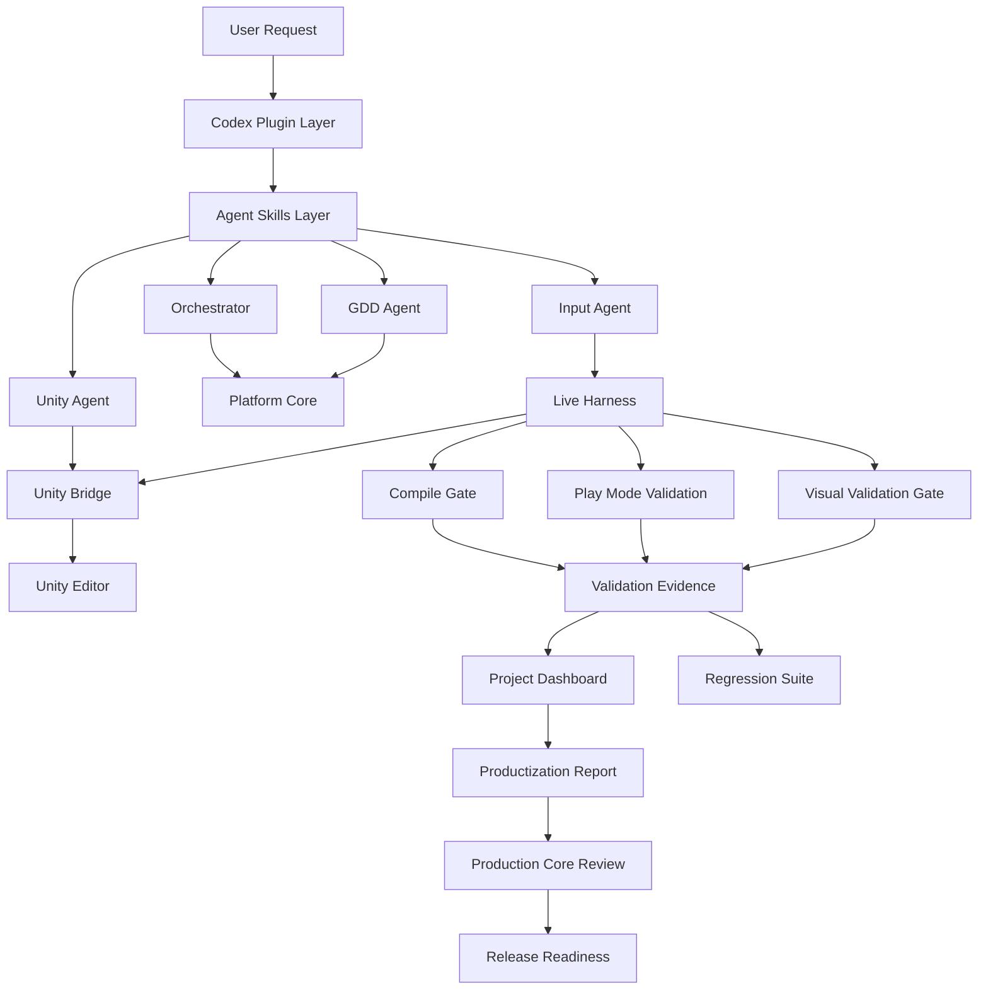

# AInvil Technical Architecture

## 목적

이 문서는 AInvil의 현재 기술 구조를 설명한다. 범위는 Codex Plugin에서 Unity Bridge, Live Harness, Validation Evidence, Productization/Release Readiness, Regression Suite까지이다.

현재 상태는 `Core Release Ready / Release Candidate` 및 `Product MVP Ready Candidate`이다. `Public Release Ready`는 주장하지 않는다.

## 전체 구조



## Codex Plugin Layer

역할:

- Codex에서 AInvil을 plugin으로 인식시키는 진입점이다.
- skill, MCP server, plugin metadata를 등록한다.
- AInvil이 단일 repo 내부에서 실행 가능한 bundle로 동작하게 한다.

주요 경로:

- `.codex-plugin/plugin.json`
- `.mcp.json`
- `skills/`
- `mcp-server/`
- `unity-package/`

## Agent Skills Layer

역할:

- Orchestrator, GDD Agent, Unity Agent, Input Agent의 책임을 분리한다.
- 사용자 의도, 문서, Unity 구현, 검증 evidence를 같은 workflow 안에서 연결한다.

책임:

- Orchestrator: 전체 production workflow 조정.
- GDD Agent: design, requirement, task, acceptance criteria 관리.
- Unity Agent: Unity scene, prefab, script, compile check, bridge interaction.
- Input Agent: Play Mode validation, input validation, evidence recording.

## Platform Core

역할:

- Codex skill과 Unity Bridge에 직접 묶이지 않는 productization logic을 담당한다.
- report, dashboard, release readiness, regression, review evaluation을 생성한다.

주요 기능:

- production state graph
- productization status
- production core review evaluation
- release readiness
- RC baseline manifest
- regression suite
- workspace/environment audit

## Unity Bridge

역할:

- Unity Editor 내부의 bridge server와 Codex/AInvil 사이의 통신을 담당한다.
- health, status, compile status, console logs, hierarchy, scene, Play Mode, validation probe 호출을 제공한다.

Canonical source:

```text
plugins/ainvil/unity-package/Packages/com.codex.unity-bridge
```

`UnityPackage/` 루트 경로는 deprecated mirror/install artifact로 취급한다.

## Live Harness

역할:

- operational validation scenario를 실행한다.
- Unity Bridge를 통해 Editor 상태를 확인하고, 필요 시 Play Mode에 진입해 validation hook을 호출한다.
- 결과를 evidence JSON으로 저장한다.

대표 scenario:

- `ainvil_bridge_smoke_operational`
- `ainvil_compile_gate_blocks_playmode_on_compile_error`
- `dungeon_recovery_first_playable_e2e`
- `dungeon_recovery_procedural_recovery_job_e2e`
- `dungeon_recovery_procedural_space_quality_validation`
- `dungeon_recovery_procedural_visual_validation`

## Validation Evidence

Evidence는 scenario 실행의 최소 source of truth이다.

필수 정보:

- scenario id
- classification
- startedAt / completedAt
- result: Passed / Failed / Blocked
- validation level
- checked steps
- console summary
- failure reason 또는 blocker
- next action

대표 경로:

```text
plugins/ainvil/validation/evidence/
```

## Compile Gate

Compile Gate는 Play Mode 검증 이전에 compile 상태를 확인한다.

검증 항목:

- Unity compile status
- local C# build check
- console compile errors
- Play Mode 진입 가능 여부

정책:

- compile error가 있으면 Play Mode에 진입하지 않는다.
- 이 경우 product failure가 아니라 `CompileBlocked` evidence로 기록한다.

## Visual Validation Gate

Visual Validation Gate는 runtime logic이 통과해도 사용자가 화면에서 플레이할 수 없는 상태를 잡기 위해 추가되었다.

검증 항목:

- screenshot evidence
- first-person camera framing
- mouse look
- player movement
- UI visibility
- missing shader / magenta detection

DungeonRecoveryCompany 최신 visual validation은 `Passed`이며, `cameraMode: FirstPerson`, `mouseLookVerified: true`, `consoleErrorCount: 0`으로 기록되었다.

## Productization / Release Readiness

Productization은 기능별 상태를 다음 중 하나로 분류한다.

- Verified
- Partial
- Blocked
- Spec-only
- Deprecated/Sample

Release Readiness는 현재 evidence와 review gate를 바탕으로 release 가능 범위를 판단한다.

현재 해석:

- Core Release Ready: Yes
- Core RC Reproducibility Verified: Yes
- Product MVP Ready Candidate: Yes
- Public Release Ready: No

## Regression Suite

Regression Suite는 Release Candidate 상태가 나중에 깨지는 것을 감지하기 위한 묶음 검증이다.

최신 full regression 결과:

```text
21 passed, 0 failed, 0 blocked
```

주요 검증:

- compile gate
- product MVP build verification
- procedural live harness
- procedural build verification
- procedural visual validation
- procedural space quality validation
- review
- productization
- release
- dashboard
- RC baseline
- schema/report validators

## EnvironmentBlocked 모델

Unity Bridge가 꺼져 있거나 Editor가 연결되지 않은 경우, 제품 기능 실패로 판정하지 않는다.

분류:

- `EnvironmentBlocked`: Unity Editor, Bridge server, port, package installation, workspace manifest 문제.
- `CompileBlocked`: compile error 때문에 Play Mode 진입 불가.
- `Failed`: 검증 대상 기능 자체의 acceptance 실패.

이 분리는 release report가 환경 문제와 제품 문제를 섞어 해석하지 않게 만든다.
